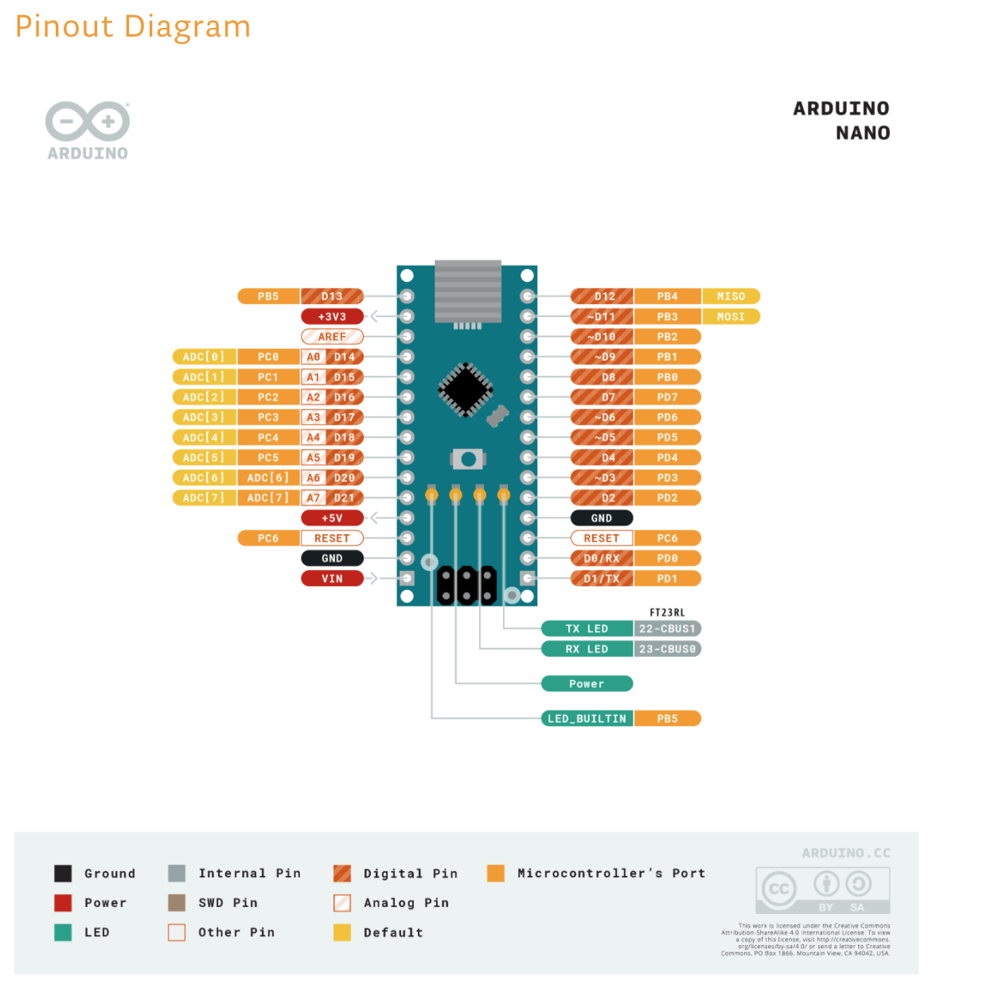
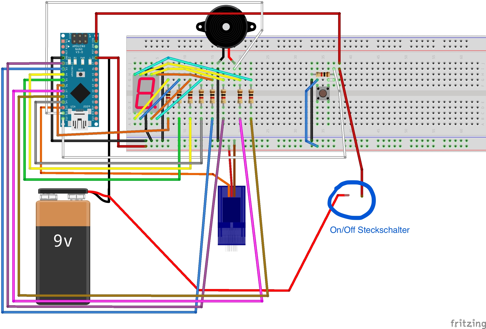

# Teetimer 
Arduino Nano based timer for automated teebag pullup

### Build With
* [Arduino IDE](https://www.arduino.cc/en/Main/software)
* [Nano V3.0 CH340 Chip](https://www.az-delivery.de/products/nano-v3-0-pro)
* [Servo SG90](https://www.funduinoshop.com/epages/78096195.sf/de_DE/?ObjectPath=/Shops/78096195/Products/A-5-3)
* [Passive buzzer](https://www.funduinoshop.com/epages/78096195.sf/de_DE/?ObjectPath=/Shops/78096195/Products/B-4-1)
* [1 digit 7 segment Anzeige](https://www.conrad.de/de/p/kingbright-7-segment-anzeige-rot-14-mm-1-85-v-ziffernanzahl-1-sa56-11srwa-160172.html?gclid=Cj0KCQjwoJX8BRCZARIsAEWBFMJaykgtCQ7-QYBjtcnwdUpXrOPuGESVGSBwpjXEptvj_uxL45Y1P9saApmoEALw_wcB&hk=SEM&WT.srch=1&WT.mc_id=google_pla&s_kwcid=AL%21222%213%21409774158645%21%21%21g%21%21&ef_id=Cj0KCQjwoJX8BRCZARIsAEWBFMJaykgtCQ7-QYBjtcnwdUpXrOPuGESVGSBwpjXEptvj_uxL45Y1P9saApmoEALw_wcB%3AG%3As)
* [Button / Taster](https://www.funduinoshop.com/epages/78096195.sf/de_DE/?ObjectPath=/Shops/78096195/Products/KT-1)
* [Bread board & Jumper Kabel](https://www.amazon.de/Breadboard-Female-Female-Male-Male-Female-Male-Steckbr%C3%BCcken/dp/B073X7GZ1P/ref=sr_1_15?__mk_de_DE=%C3%85M%C3%85%C5%BD%C3%95%C3%91&dchild=1&keywords=breadboard&qid=1602602265&sr=8-15)
* Wood and Allen keys
  

<!-- GETTING STARTED -->
## Getting Started

To use the project follow the steps below.

### Prerequisites
* Arduino IDE
* Mini USB cabel
* Too much time on your hand

### Good to know when altering code

* the cheap servo starts buzzing when using max min position (0° / 180°). Let some headspace if atleast 5°
* little delays in between code lines magically helps to keep things working
* the cheap buzzer can't play any other tones, atleast as far as iam concerned
* Keep in mind that some digital Pins (for example 6~) have PWM (pulse-width-modulation) to achieve some functions of an analog pin. This allows for values between 0 and 255 instead of just 0 and 1. Some Parts need this extra values. Below is a map of the Pins for an Arudino Nano:
 

<cite>Pinout Diagram</cite> by https://store.arduino.cc/arduino-nano

 

### Upload new code on Arduino

1. Connect the Nano via usb

2. Open Arduino IDE

3. Select "Werkzeuge--> Port --> /dev/..serial..usb"

4. Click on "Hochladen"

### In case of disconnected cabels

Here is a simplified circuit diagram in case of disconnected cabels or similar problems. U can also use the software 'fritzing' and load the tee_timer.fzz file. When you create an account on [fritzing.org](https://fritzing.org/), you can download it for free.

 

circuit diagram

  

<!-- USAGE EXAMPLES -->
## Usage

1. Connect the two red cabels for power delivery. You shoud see a '.' on the display.

2. Press the Button once. Now the statemachine is in state 1 and waits for further input.

3. Press the Button x times for x minutes. Pressing more than 9 times resets the counter.

4. After a threshold of 3 secs, the timer starts and the teebag is lowered. Preesing the button while the timer is on, you expand the time by 1 minute. It coud appear, that the servo starts buzzing. Don't worry just give it a tab or leave it buzzin.

5. After the given time, the teebag gets pulled up again. You shoud hear an acoustic signal telling you the program finished.

6. Disconnect the red cabels for saving energy.
  

<!-- CONTACT -->
## Contact

Bastian Lührs-Püllmann - bastian.puellm@gmail.com
  

<!-- ACKNOWLEDGEMENTS -->
## Acknowledgements
* [display usage](https://42project.net/eine-sieben-segment-display-anzeige-direkt-mit-dem-arduino-ansteuern/#lightbox/1/)
* [buzzer usage](https://funduino.de/nr-08-toene-erzeugen)
* [servo usage](https://funduino.de/nr-12-servo-ansteuern)
* [button usage](https://funduino.de/nr-5-taster-am-arduino)
